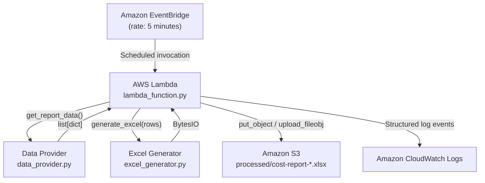
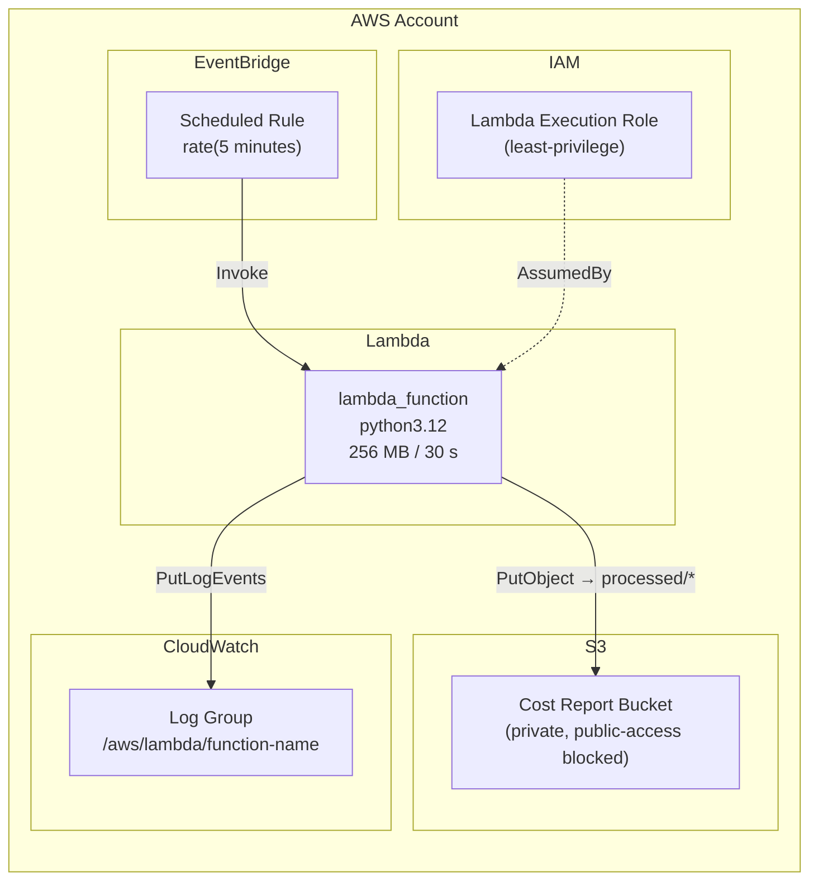
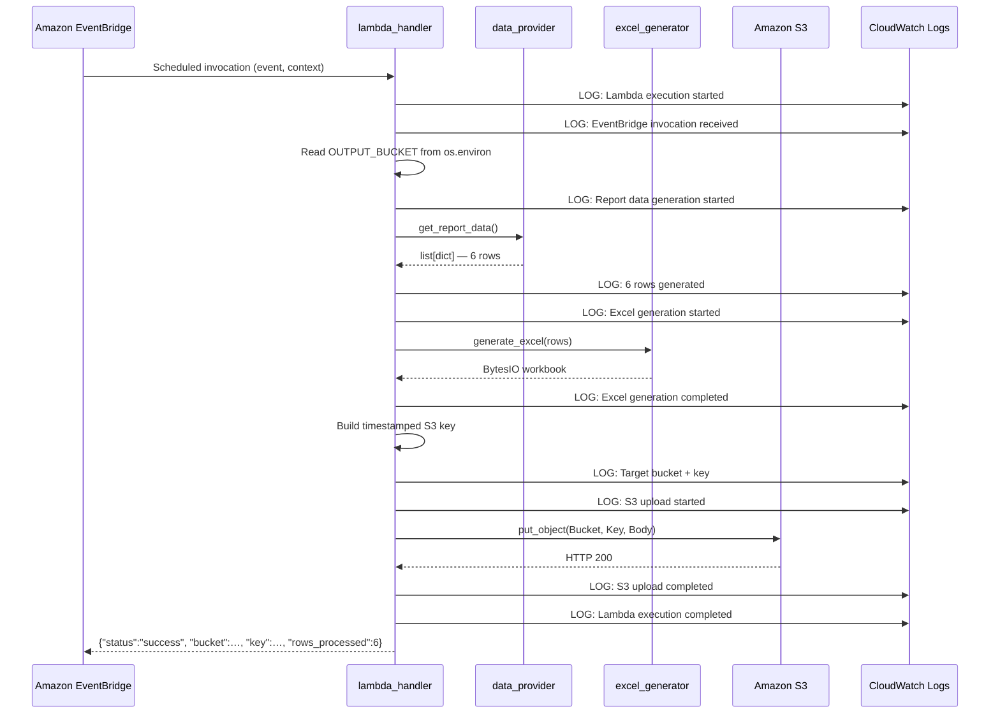
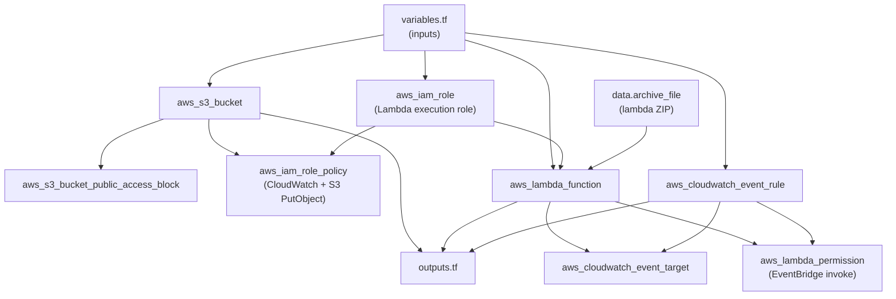
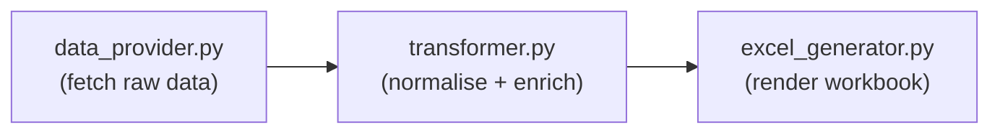

# Technical Design — EventBridge Lambda Excel S3

## Overview

This document describes the complete technical design for the scheduled cost-reporting
workflow. The system is intentionally minimal: Amazon EventBridge triggers an AWS Lambda
function every five minutes, the Lambda generates an Excel workbook in memory, and uploads
the workbook to Amazon S3. All AWS infrastructure is managed by Terraform.

---

## 1. Architecture Overview

### 1.1 High-Level Component Diagram



### 1.2 AWS Resource Topology



---

## 2. Execution Sequence

The following describes the end-to-end flow that occurs every five minutes.



---

## 3. Component Responsibilities

### 3.1 `lambda_function.py` — Orchestrator

**Single responsibility:** Wire the workflow together and handle all AWS interactions.

Responsibilities:
- Define `lambda_handler(event, context)` — the Lambda entry point.
- Read `OUTPUT_BUCKET` from `os.environ`; raise `EnvironmentError` if absent.
- Call `data_provider.get_report_data()` to obtain report rows.
- Call `excel_generator.generate_excel(rows)` to obtain a `BytesIO` workbook.
- Build the timestamped S3 object key.
- Upload the workbook to S3 using `boto3`.
- Emit structured log messages at each step using the `logging` module.
- Catch all exceptions, log them with `logger.exception()`, and re-raise.
- Return the structured success dictionary.

What it must NOT do:
- Define raw data rows.
- Contain Excel workbook logic.
- Hardcode bucket names, region strings, or schedule expressions.

### 3.2 `data_provider.py` — Data Layer

**Single responsibility:** Supply the report data as a stable, typed list of dicts.

Responsibilities:
- Export `get_report_data() -> list[dict]`.
- Return exactly six rows with the agreed schema (see Section 4).
- Contain inline dummy data in the initial implementation.
- Document the stable return schema so future integrations can be dropped in.

What it must NOT do:
- Import or call any AWS SDK.
- Reference Excel or openpyxl.
- Contain any transformation or formatting logic.

### 3.3 `excel_generator.py` — Presentation Layer

**Single responsibility:** Accept structured data and produce a formatted Excel workbook.

Responsibilities:
- Export `generate_excel(rows: list[dict]) -> BytesIO`.
- Create a workbook with one worksheet named `Cost Report`.
- Write headers, data rows, formatting, table, freeze panes, filters, and column widths.
- Return the workbook serialised into a `BytesIO` buffer.

What it must NOT do:
- Import or call any AWS SDK.
- Know where the workbook will be stored.
- Contain data definitions.

---

## 4. Excel Data Model

### 4.1 Data Provider Output Schema

`get_report_data()` returns a `list[dict]` where each dict conforms to:

```python
{
    "item":     str,   # Display name of the cost item
    "location": str,   # Deployment location
    "jan_2026": float, # Cost for January 2026
    "feb_2026": float,
    "mar_2026": float,
    "apr_2026": float,
    "may_2026": float,
    "jun_2026": float,
    "jul_2026": float,
    "aug_2026": float,
    "sep_2026": float,
}
```

**Key constraints:**
- The schema is considered a stable interface contract between the data provider and
  the Excel generator.
- All monthly values are positive numbers.
- The dict keys use lowercase with underscores (`jan_2026`, not `Jan 2026`).
  The Excel generator maps them to display-friendly column headers.

### 4.2 Column-to-Key Mapping

| Excel Column Header | Dict Key    |
|---------------------|-------------|
| Item                | `item`      |
| Location            | `location`  |
| Jan 2026            | `jan_2026`  |
| Feb 2026            | `feb_2026`  |
| Mar 2026            | `mar_2026`  |
| Apr 2026            | `apr_2026`  |
| May 2026            | `may_2026`  |
| Jun 2026            | `jun_2026`  |
| Jul 2026            | `jul_2026`  |
| Aug 2026            | `aug_2026`  |
| Sep 2026            | `sep_2026`  |

### 4.3 Dummy Data Values

The initial implementation uses these dummy values:

| Item                   | Location   | Jan 2026 | Feb 2026 | Mar 2026 | Apr 2026 | May 2026 | Jun 2026 | Jul 2026 | Aug 2026 | Sep 2026 |
|------------------------|------------|----------|----------|----------|----------|----------|----------|----------|----------|----------|
| SQL LTC                | US-East    | 12000    | 12450    | 12600    | 12750    | 12900    | 13050    | 13200    | 13550    | 13900    |
| AWS ARR                | US-East    |  8500    |  8700    |  8750    |  8800    |  8900    |  9000    |  9100    |  9200    |  9300    |
| AWS FIRE               | US-West    |  7200    |  7400    |  7450    |  7500    |  7600    |  7700    |  7800    |  7950    |  8100    |
| SQL Health Supp/Retire | On-Prem    | 15500    | 15100    | 14800    | 14500    | 14200    | 13900    | 13600    | 13400    | 13200    |
| Azure Filer (All)      | Azure-East |  9800    | 10000    | 10100    | 10200    | 10350    | 10500    | 10600    | 10700    | 10800    |
| Filer (All)            | Global     | 11000    | 11200    | 11350    | 11450    | 11550    | 11650    | 11700    | 11800    | 11900    |

---

## 5. Excel Generation Design

### 5.1 Workbook Construction Flow

```
create_workbook()
      │
      ├── Create worksheet "Cost Report"
      │
      ├── Write header row (row 1)
      │       bold=True, all 11 columns
      │
      ├── Write data rows (rows 2–7)
      │       one row per dict from data provider
      │
      ├── Apply number format to cost columns (C–K)
      │       format: "#,##0.00" or "#,##0"
      │
      ├── Create Excel Table
      │       ref: A1:K7, displayName: "CostReport"
      │       style: TableStyleMedium9 (or equivalent)
      │
      ├── Enable AutoFilter on header row
      │
      ├── Freeze panes at A2
      │
      ├── Set column widths
      │       A (Item):     28 chars
      │       B (Location): 14 chars
      │       C–K (months): 12 chars each
      │
      └── Save to BytesIO → return buffer
```

### 5.2 openpyxl Table Note

When a worksheet has an Excel Table applied via `openpyxl.worksheet.table.Table`,
the table already provides built-in header formatting, banding, and filter arrows.
The explicit AutoFilter call is therefore optional if a Table is used, but kept for
compatibility clarity.

### 5.3 BytesIO Pattern

```python
from io import BytesIO
import openpyxl

def generate_excel(rows: list[dict]) -> BytesIO:
    wb = openpyxl.Workbook()
    ws = wb.active
    ws.title = "Cost Report"
    # ... build workbook ...
    buffer = BytesIO()
    wb.save(buffer)
    buffer.seek(0)
    return buffer
```

---

## 6. S3 Design

### 6.1 Bucket Configuration

| Attribute                | Value                                           |
|--------------------------|-------------------------------------------------|
| Name                     | Derived from `${project_name}-${environment}`  |
| Region                   | `var.aws_region`                               |
| Versioning               | Not required (out of scope for MVP)            |
| Encryption               | AWS-managed default encryption (SSE-S3)        |
| Public access            | Fully blocked (all four settings = `true`)     |
| Lifecycle rules          | Not required (out of scope for MVP)            |
| Event notifications      | Not required                                   |

### 6.2 Object Key Strategy

```
processed/cost-report-{YYYY}-{MM}-{DD}-{HHMMSS}.xlsx
```

The timestamp is generated in the Lambda using UTC:

```python
from datetime import datetime, timezone

timestamp = datetime.now(timezone.utc).strftime("%Y-%m-%d-%H%M%S")
key = f"processed/cost-report-{timestamp}.xlsx"
```

Because EventBridge fires every five minutes, timestamps will always differ between
consecutive executions.

### 6.3 Upload Call

```python
import boto3

s3 = boto3.client("s3")
s3.put_object(
    Bucket=bucket_name,
    Key=key,
    Body=buffer.getvalue(),
    ContentType="application/vnd.openxmlformats-officedocument.spreadsheetml.sheet",
)
```

Setting `ContentType` ensures the object is recognisable as an Excel file when
downloaded from S3 directly.

---

## 7. Terraform Design

### 7.1 File Responsibilities

| File              | Responsibility                                                       |
|-------------------|----------------------------------------------------------------------|
| `providers.tf`    | AWS provider declaration and required Terraform version constraint   |
| `variables.tf`    | All input variable declarations with types, descriptions, defaults   |
| `main.tf`         | Local values and any cross-cutting data sources                      |
| `s3.tf`           | S3 bucket, public access block                                       |
| `iam.tf`          | IAM role, assume-role policy, inline/attached policies               |
| `lambda.tf`       | Lambda function resource, environment variables, ZIP data source     |
| `eventbridge.tf`  | EventBridge rule, Lambda target, Lambda invocation permission        |
| `outputs.tf`      | All output value declarations                                        |

### 7.2 Resource Dependency Graph



### 7.3 Lambda Packaging in Terraform

Terraform will reference the deployment ZIP produced by `scripts/package_lambda.sh`.
A `data "archive_file"` resource or a direct `filename` reference can be used.
The recommended approach uses a pre-built ZIP path:

```hcl
resource "aws_lambda_function" "cost_report" {
  filename         = "${path.module}/../lambda_package/lambda.zip"
  source_code_hash = filebase64sha256("${path.module}/../lambda_package/lambda.zip")
  # ...
}
```

This approach keeps Terraform focused on infrastructure and delegates build concerns
to the packaging script.

---

## 8. IAM Design

### 8.1 Trust Relationships

| Principal            | Allowed Action      | Resource          |
|----------------------|---------------------|-------------------|
| `lambda.amazonaws.com` | `sts:AssumeRole`  | Lambda exec role  |
| `events.amazonaws.com` | `lambda:InvokeFunction` | Lambda function |

### 8.2 Lambda Execution Role Policy

The role receives a single inline policy with two statement blocks:

**Statement 1 — CloudWatch Logs:**
```json
{
  "Effect": "Allow",
  "Action": [
    "logs:CreateLogGroup",
    "logs:CreateLogStream",
    "logs:PutLogEvents"
  ],
  "Resource": "arn:aws:logs:<region>:<account-id>:log-group:/aws/lambda/<function-name>:*"
}
```

**Statement 2 — S3 PutObject (least-privilege):**
```json
{
  "Effect": "Allow",
  "Action": ["s3:PutObject"],
  "Resource": "arn:aws:s3:::<bucket-name>/processed/*"
}
```

### 8.3 EventBridge → Lambda Permission

```hcl
resource "aws_lambda_permission" "allow_eventbridge" {
  statement_id  = "AllowEventBridgeInvoke"
  action        = "lambda:InvokeFunction"
  function_name = aws_lambda_function.cost_report.function_name
  principal     = "events.amazonaws.com"
  source_arn    = aws_cloudwatch_event_rule.schedule.arn
}
```

### 8.4 What Is Explicitly Excluded

- No `AdministratorAccess` or `PowerUserAccess` managed policies.
- No wildcard actions (`"Action": "*"`).
- No wildcard resource for S3 (`"Resource": "arn:aws:s3:::*"`).
- No `s3:GetObject`, `s3:DeleteObject`, or `s3:ListBucket` unless a requirement is
  added in the future.

---

## 9. Lambda Packaging Design

### 9.1 Strategy

The Lambda deployment package is a ZIP archive that contains:
1. All Python source files from `src/`.
2. All dependencies listed in `src/requirements.txt`, installed flat into the root
   of the ZIP (i.e., site-packages flattened to the ZIP root level).

### 9.2 Packaging Script (`scripts/package_lambda.sh`)

Conceptual steps:

```
1. Clean previous build:   rm -rf lambda_package/
2. Create working dir:     mkdir -p lambda_package/
3. Install dependencies:
       pip install -r src/requirements.txt \
           --target lambda_package/ \
           --platform manylinux2014_x86_64 \
           --only-binary=:all:
4. Copy source files:      cp src/*.py lambda_package/
5. Create ZIP:             cd lambda_package && zip -r ../lambda.zip .
6. Confirm output:         echo "Package ready: lambda.zip"
```

Notes:
- The `--platform manylinux2014_x86_64` flag ensures binary wheels are compatible
  with the Lambda Amazon Linux runtime.
- `openpyxl` is pure Python so the platform flag is not strictly required for it,
  but is included as a good practice for any future dependencies.
- The output `lambda.zip` is placed at the repository root (git-ignored).
- `lambda_package/` is also git-ignored.

### 9.3 `src/requirements.txt`

```
openpyxl>=3.1,<4.0
```

`boto3` is not listed because it is provided by the Lambda runtime environment.

---

## 10. Configuration Design

### 10.1 Lambda Environment Variables

| Variable       | Source             | Description                          |
|----------------|--------------------|--------------------------------------|
| `OUTPUT_BUCKET`| Terraform / `aws_lambda_function` `environment` block | S3 bucket name for Excel uploads |

Additional variables may be added in future (e.g., `LOG_LEVEL`, `REPORT_PREFIX`)
without changing the Lambda function's core logic.

### 10.2 Terraform Variables

| Variable              | Type   | Default           | Description                              |
|-----------------------|--------|-------------------|------------------------------------------|
| `aws_region`          | string | `"us-east-1"`     | AWS region for all resources             |
| `environment`         | string | —                 | Deployment environment (e.g. `dev`, `prod`) |
| `project_name`        | string | —                 | Project identifier used in resource names |
| `schedule_expression` | string | `"rate(5 minutes)"` | EventBridge schedule expression        |
| `lambda_memory_size`  | number | `256`             | Lambda memory in MB                      |
| `lambda_timeout`      | number | `30`              | Lambda timeout in seconds                |

### 10.3 Terraform Outputs

| Output                  | Description                          |
|-------------------------|--------------------------------------|
| `s3_bucket_name`        | Name of the provisioned S3 bucket    |
| `lambda_function_name`  | Name of the Lambda function          |
| `eventbridge_rule_name` | Name of the EventBridge scheduled rule |

---

## 11. Logging and Error Handling Design

### 11.1 Logger Setup

```python
import logging

logger = logging.getLogger(__name__)
logger.setLevel(logging.INFO)
```

Lambda automatically forwards log output to CloudWatch Logs. No additional handler
configuration is required.

### 11.2 Log Event Catalogue

| Event                         | Level   | Sample Message                                     |
|-------------------------------|---------|----------------------------------------------------|
| Execution started             | INFO    | `"Lambda execution started"`                       |
| EventBridge invocation        | INFO    | `"EventBridge invocation received"`                |
| Data generation started       | INFO    | `"Report data generation started"`                 |
| Row count                     | INFO    | `"Generated 6 report rows"`                        |
| Excel generation started      | INFO    | `"Excel generation started"`                       |
| Excel generation completed    | INFO    | `"Excel generation completed"`                     |
| Target bucket                 | INFO    | `"Target S3 bucket: my-bucket"`                    |
| Target key                    | INFO    | `"Target S3 key: processed/cost-report-…xlsx"`     |
| Upload started                | INFO    | `"S3 upload started"`                              |
| Upload completed              | INFO    | `"S3 upload completed"`                            |
| Execution completed           | INFO    | `"Lambda execution completed successfully"`        |
| Exception                     | ERROR   | `"Unhandled exception during execution"` + traceback |

### 11.3 Error Handling Pattern

```python
def lambda_handler(event, context):
    logger.info("Lambda execution started")
    try:
        # ... workflow steps ...
        return result
    except Exception:
        logger.exception("Unhandled exception during execution")
        raise
```

Re-raising ensures:
- Lambda records the invocation as `FAILED` in CloudWatch metrics.
- EventBridge can be configured with a dead-letter queue or retry policy in future.
- The error is visible in Lambda's built-in error monitoring.

---

## 12. Testing Strategy

### 12.1 Unit Tests — Scope

Unit tests target `excel_generator.py` and `data_provider.py` exclusively.
They must not make network calls, require AWS credentials, or write to disk.

| Module              | What to test                                                     |
|---------------------|------------------------------------------------------------------|
| `excel_generator.py`| Workbook structure, worksheet name, headers, row count, numeric values, BytesIO output |
| `data_provider.py`  | Return type is `list[dict]`, exactly 6 rows, correct item names, correct keys present, numeric monthly values |

### 12.2 Unit Test File Structure

```
tests/
└── test_excel_generator.py    # REQ-10.1, REQ-10.2 (T-01 through T-08)
```

Additional test files (`test_data_provider.py`) may be added but are not required
by this spec.

### 12.3 Integration Tests — Out of Scope

Testing the full Lambda → S3 flow requires AWS credentials, a live bucket, and
deployed infrastructure. This is considered out of scope for the unit test suite.

Manual integration testing procedure is documented in the README:

```
1. terraform apply
2. aws lambda invoke --function-name <name> response.json
3. cat response.json
4. aws s3 ls s3://<bucket>/processed/
```

### 12.4 Test Dependencies

```
pytest>=7.0
openpyxl>=3.1,<4.0
```

A `tests/requirements.txt` or a `pyproject.toml` `[dev]` extras block may be used.
The simplest approach is a root-level `requirements-dev.txt`.

---

## 13. Repository Structure

```
eventbridge-lambda-excel-s3/
│
├── .kiro/
│   └── specs/
│       └── eventbridge-lambda-excel-s3/
│           ├── requirements.md       ← Functional and non-functional requirements
│           ├── design.md             ← This document
│           └── tasks.md              ← Phased implementation task list
│
├── src/
│   ├── lambda_function.py            ← Lambda handler (orchestrator)
│   ├── data_provider.py              ← Report data layer (dummy implementation)
│   ├── excel_generator.py            ← Excel workbook generation
│   └── requirements.txt              ← Python runtime dependencies (openpyxl)
│
├── tests/
│   └── test_excel_generator.py       ← Unit tests for Excel generation
│
├── terraform/
│   ├── providers.tf                  ← AWS provider + Terraform version constraint
│   ├── variables.tf                  ← All input variable declarations
│   ├── main.tf                       ← Local values, data sources
│   ├── s3.tf                         ← S3 bucket + public access block
│   ├── iam.tf                        ← Lambda execution role + policies
│   ├── lambda.tf                     ← Lambda function resource
│   ├── eventbridge.tf                ← EventBridge rule, target, Lambda permission
│   └── outputs.tf                    ← Output values
│
├── scripts/
│   └── package_lambda.sh             ← Dependency + source packaging script
│
├── README.md                         ← Project documentation
└── .gitignore                        ← Excludes state, ZIPs, caches, secrets
```

No structural deviations from the agreed layout are required for this project.

---

## 14. Future Extensibility

### 14.1 Replacing the Dummy Data Provider

The current `data_provider.py` returns hardcoded dummy rows. This can be replaced
with a real data source by creating a new module that conforms to the same interface:

```python
def get_report_data() -> list[dict]:
    """
    Returns a list of cost report rows.
    Each row must conform to the schema defined in design.md Section 4.1.
    """
    ...
```

`excel_generator.py` and `lambda_function.py` require zero changes for this swap.

### 14.2 Candidate Future Integrations

| Source        | Approach                                                              |
|---------------|-----------------------------------------------------------------------|
| Flexera       | HTTP API call inside `data_provider.py`; map response to schema       |
| Apptio        | HTTP API call; transform JSON to agreed schema                        |
| AXIS Database | Direct DB query (via VPC or secrets); return rows in schema format    |
| S3 Input File | `s3.get_object()` to fetch CSV/JSON; parse and transform              |

### 14.3 Transformation Layer (Future)

If data transformation becomes complex, a dedicated `transformer.py` module can sit
between `data_provider.py` and `excel_generator.py`:



This extension is not required now and must not be implemented prematurely.

### 14.4 Potential Future Enhancements (Not in Scope)

The following are explicitly out of scope for this implementation but noted for
future planning:

- S3 lifecycle rules for automatic archival of old reports.
- SNS/SES email notification on successful upload.
- Multiple worksheets or report types in a single workbook.
- Parameterised report date ranges passed via EventBridge input.
- Multiple output formats (CSV, PDF) alongside XLSX.

None of these require architectural changes to the core Lambda → S3 pipeline as
designed here.
